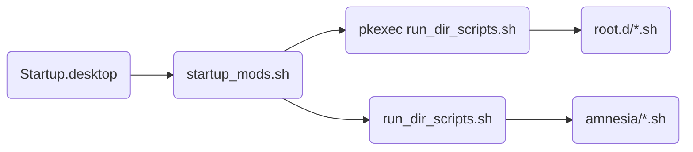

# Tails Autostart

## What is it?

Automatically start scripts/applications on tails bootup

## Why make this?

There were several scripts I wanted to run each time I booted up tails, so I created this mechanism for doing so.

This works to facilitate [tails-overlay](https://gitlab.com/tstone2077/tails-overlay) as well.

## How do I use it?

1. Make sure you have dotfiles turned on in your persistence configuration.
1. Clone this repository
```
mkdir -p /live/persistence/dotfiles/.config
clone https://gitlab.com/tstone2077/tails-autostart /live/persistence/dotfiles/.config/autostart
```

Done. Now, add any scripts to .config/autostart/amnesia.d to execute on startup them as amnesia; add any scripts to .config/autostart/root.d to execute them on startup as root.

## How does it work?
run_dir_scripts.sh runs all the scripts ending in '.sh' in a particular directory. This way, we use the same script to run amnesia.d scripts and root.d scripts.

startup_mods.sh runs 'run_dir_scripts.sh' for each user (root and amnesia). running as root is done using pkexec (gui for sudo prompt).

Finally, using Gnome's autostart feature, Startup.desktop is run each time gnome starts up. This startup.desktop runs 'bash /home/amnesia/.config/autostart/startup_mods.sh'

So on startup, gnome runs:


