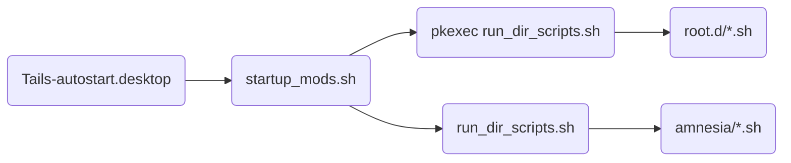

# Tails Autostart

## What is it?

Automatically start scripts/applications on tails bootup

## Why make this?

There could be a need for several scripts to run each time Tails boots up, so this is a mechanism for doing so.

## How do I install it on Tails?

1. Make sure you have dotfiles feature turned on in your persistence configuration.

2. Download and unpack asset files:
   ```shell
   cd ~/Downloads
   wget https://raw.githubusercontent.com/dutu/tails-autostart/master/assets/tails-autostart.tar.gz
   tar -xzvf tails-autostart.tar.gz -C tails-autostart
   ```

3. Run the installation script:
   ```shell
   cd tails-autostart
   chmod +x install_tails_autostart.sh
   ./install_tails_autostart.sh
   ```

Done.

## How do I use it?

* add any scripts to `/live/persistence/TailsData_unlocked/dotfiles/.config/autostart/amnesia.d` to execute them on startup as amnesia
* add any scripts to `/live/persistence/TailsData_unlocked/dotfiles/.config/autostart/root.d` to execute them on startup as root

## How does it work?
`run_dir_scripts.sh` runs all the scripts ending in `.sh` in a particular directory. This way, we use the same script to run `amnesia.d` scripts and `root.d` scripts.

`startup_mods.sh` runs `run_dir_scripts.sh` for each user (root and amnesia). running as root is done using `pkexec` (gui for sudo prompt).

Finally, using Gnome's autostart feature, `Tails-autostart.desktop` is run each time Gnome starts up. This `Tails-autostart.desktop` runs `/live/persistence/TailsData_unlocked/tails-autostart/startup_mods.sh`

So on startup, gnome runs:



> Note: `startup_mods.sh` now checks for `.sh` script files in `.config/autostart/root.d`. If no files are found, `pkexec` is not executed. This is to avoid unnecessary prompt to enter admin password after Gnome starts up.     

## How do I remove it from Tails?

1. Remove `Tails-autostart.desktop` and example scripts:
   ```shell
   rm /live/persistence/TailsData_unlocked/dotfiles/.config/autostart/Tails-autostart.desktop
   find /live/persistence/TailsData_unlocked/dotfiles/.config/autostart/ -type f -name "*.example" -exec rm -f {} +
   ```
   
2. Remove Tails-autostart script files
   ```shell
   sudo rm -rf /live/persistence/TailsData_unlocked/tails-autostart
   ```

> Note: Custom scripts that were added to `amnesia.d` and `root.d` directories are not removed, but these scripts are not run at startup anymore. 